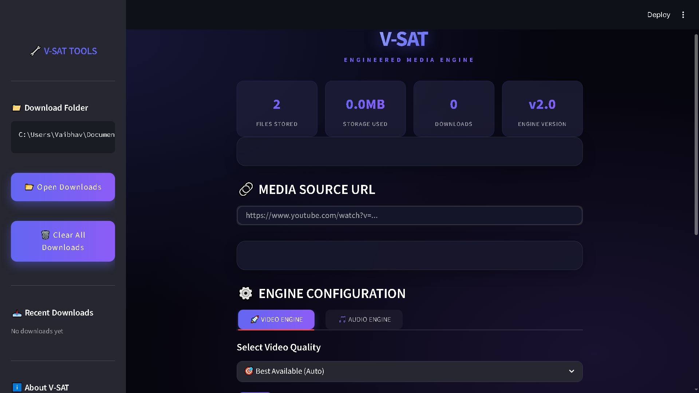
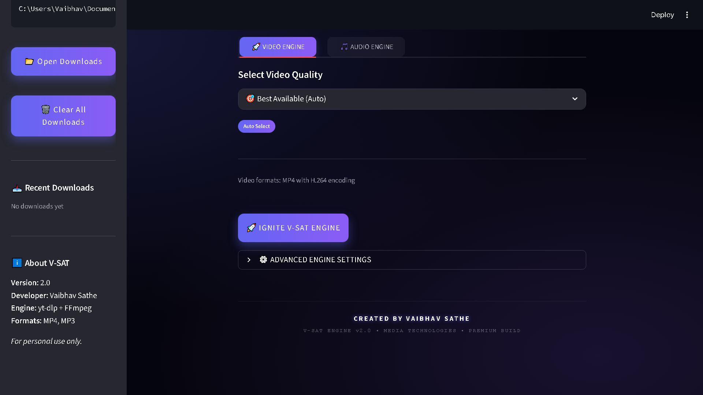
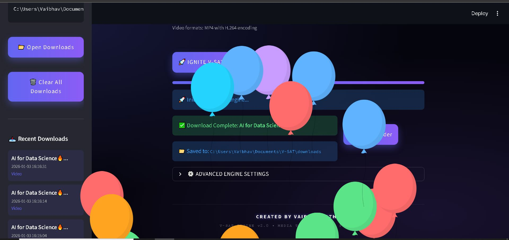

# V-SAT | Engineered Media Engine

<div align="center">


**A Professional YouTube Downloader with Premium Interface**

A sleek, powerful YouTube video and audio downloader built with Streamlit and yt-dlp.

</div>

---

## 📋 Overview

**V-SAT** is a professional-grade YouTube downloader that combines powerful media downloading capabilities with a modern, premium user interface.  
It allows users to download videos in multiple resolutions or extract high-quality audio with ease.

---

## ✨ Features

### 🎬 Video Downloads
- Multiple resolutions: **480p, 720p, 1080p**
- Auto quality detection
- MP4 format (H.264 + AAC)
- Single video and playlist support

### 🎵 Audio Extraction
- MP3 format
- Bitrates: **128kbps, 192kbps, 320kbps**
- Clean audio conversion using FFmpeg

### 🖥️ User Interface
- Premium dark theme with gradient accents
- Real-time progress and speed display
- Thumbnail preview before download
- Download statistics and session history
- Desktop-style responsive layout

### 🛠️ Additional Features
- Playlist downloads
- Download history tracking
- One-click access to download folder
- Advanced settings panel
- Organized file naming with V-SAT prefix

---

## 🚀 Quick Start

### Prerequisites
- Python **3.9 or higher**
- pip (Python package manager)
- FFmpeg (required for audio extraction)

### Installation

1. **Clone the repository**
```bash
git clone https://github.com/VaibhavSathe/V-SAT.git
cd V-SAT
```

2. **Install dependencies**
```bash
pip install -r requirements.txt
```

3. **Run the application**
```bash
streamlit run app.py
```
## 📸 Screenshots

### 🏠 Main Dashboard


### 🔗 URL Input & Thumbnail Preview


### ⬇️ Download in Progress


### 📊 Statistics & Tools Panel


> 💡 On Windows, you can also double-click **run.bat**

---

## 📁 Project Structure

```
V-SAT/
├── app.py                 # Main application file
├── requirements.txt       # Python dependencies
├── run.bat               # Windows launcher
├── README.md             # Documentation
└── downloads/            # Downloaded media
```

---

## 📖 How to Use

1. Launch the application  
2. Paste a YouTube video or playlist URL  
3. Choose **Video Engine** or **Audio Engine**  
4. Select desired resolution or bitrate  
5. Click **“IGNITE V-SAT ENGINE”**  
6. Monitor download progress  
7. Access files from the `downloads/` folder  

---

## 🔧 Technical Details

### Core Components
- **yt-dlp** — Media download engine  
- **Streamlit** — UI framework  
- **FFmpeg** — Media processing  

### Supported Formats
- **Video:** MP4 (H.264/AAC)  
- **Audio:** MP3  
- **Resolutions:** Auto, 480p, 720p, 1080p  

---

## ⚠️ Legal & Usage Notice

This project is intended for:
- Personal use
- Educational and research purposes
- Downloading content you own or have permission to use

Please respect:
- Copyright laws
- YouTube Terms of Service
- Content creators’ rights

---

## 🐛 Troubleshooting

### Video not downloading
- Check URL validity
- Ensure video is public
- Try another quality option

### Audio issues
- Verify FFmpeg is installed and available in PATH
- Try a different bitrate

### Slow speed
- Depends on network and source
- Try lower resolution

---

## 🤝 Contributing

Contributions are welcome.

1. Fork the repository  
2. Create a new branch  
3. Commit your changes  
4. Open a Pull Request  

---

## 📄 License

This project is licensed under the **MIT License**.

---

## 👤 Author

**Vaibhav Sathe**  
GitHub: [@VaibhavSathe](https://github.com/VaibhavSathe)  
Email: vaibhavsathe.dev@gmail.com  

---

## 🙏 Acknowledgments

- Streamlit  
- yt-dlp  
- FFmpeg  
- Open-source community  

---

<div align="center">

**V-SAT | Engineered Media Engine**  
Premium • Clean • Powerful

</div>
